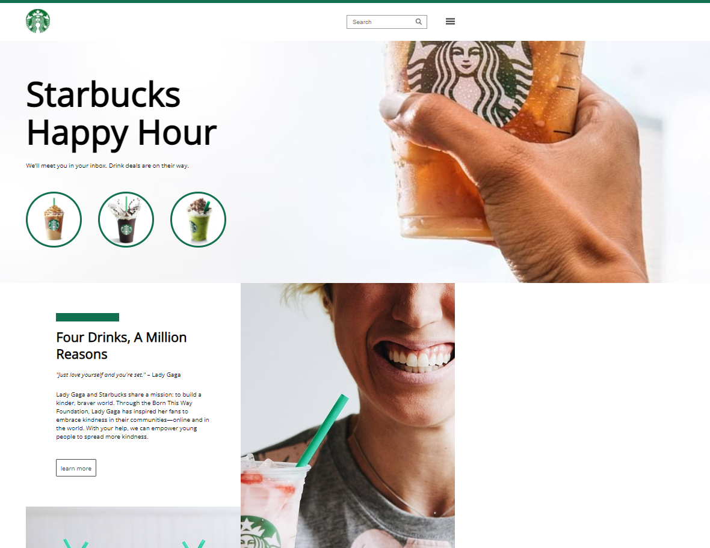

    <h1>Criação do clone da página do starbucks</h1>

Neste projeto, será replicado a intareface do site da Starbucks utilizando tecnologias e conseitos como HTML5, CSS3, Flexbox, Grid. Também será estruturado um layout, técnicas de CSS3 com containers e variáveis, como posicionar os elementos com Flexbox e Grid a favor da aplicação.

Também será aplicado uma Pipeline de integração continua e testes da aplicação.

 

    <a href="https://wellington197.github.io/Clone_Starbucks/" height="95px" width="440px">LINK PARA EXECUTAR PROJETO
    </a>

 

<h1>Página do projeto</h1>
  

### Conceitos aplicados no projeto
- Criação do clone da página inicial da Starbucks;
- Aplicação de conceitos em FLEXBOX e Grid;
- Estilização em HTML5 e CSS3;
- Subindo projeto para GitHub;
- Efetuando o build e deploy via github actions;

### Atividades realizadas 

- [X] Criação da página inicial
- [X] Estilização via CSS3 com Flexbox e Grid
- [X] Aplicação de posicionamento dos elementos
- [X] Criação de repositório no GitHub
- [X] Edição de um projeto
- [X] Criação e edição do Readme
- [X] Finalização do projeto

## O que a plataforma é capaz de fazer :checkered_flag:

:trophy: Plataforma criada com conceito de responsividade. 
:trophy: Criação e adição de repositório no GitHub 
:trophy: Criação e edição do Readme 

## Como está andamento do projeto.

> Status do Projeto: Concluido :heavy_check_mark: 
> Status do Projeto: Em desenvolvimento :heavy_check_mark:

## Linguagens e libs utilizadas :books:
    * LINGUAGENS
        - HTML5
        - CSS3

    * METODOLOGIA
        - Flexbox e Grid
        - RESPONSIVIDADE
        - 

    * FERRAMENTAS
        - GitHub
        - GitPages
        - Visual Stúdio

## Mentoria e Colaboração:

[<h5>Mentoria</h5>    Bonieki Lacerda](https://github.com/bonieky) |[<h5>Dev</h5>     Francisco Wellington Costa ](https://github.com/wellington197) |
| :---: | :---: | 